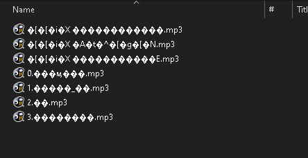

# jpzip
jpzip is a simple program to extract archive that contains files with name in Japanese correctly using 7zip.


[](https://github.com/psf/black)


## Introduction
Deal with archive files that contain files with name in Japanese all the time?
Frequent customer on DLSite or other Japanese sites?

When you tried to extract these archive using 7zip, you got error like below.



After a few hours researching the correct combination of command line options 
and arguments, I finally get 7zip to extract archive files with name in Japanese 
correctly, but it is pain to input those every time.

That's why I created this program.

## Installation
1. Download the archive from Releases.
2. Extract to anywhere you like.
3. (Optional) Set up the PATH pointed to the directory that you extract the archive. This to make sure that jp7zip is 
accessible to anywhere in your system.

## Usage
```
jpzip [-h] [-o OUTPUT | -os] input
```
```
input                 (Required) Input archive.
-h, --help            show this help message and exit
-o OUTPUT, --output OUTPUT
                      Output directory. If not specified, output will be at the same directory as the archive.
-os, --output_same    Output to a new directory with same name with the archive name.
```
### Extract files to an output directory:

```
jpzip <path to input archive> [-o|--output] <path to output directory>
```

### Extract files to the new folder with archive name:

```
jpzip <path to input archive> [-os|--output_same]
```

### Extract files to the current directory:
```
jpzip <path to input archive>
```

## Information
The actual command that passed to 7zip is:
```
7za.exe x -mcp=932 <input archive> -o<output directory>
```

## License
```
jpzip is a simple program to extract archive that contains files with 
name in Japanese correctly using 7zip.

Copyright (C) 2022 Miracutor

This program is free software: you can redistribute it and/or modify
it under the terms of the GNU General Public License as published by
the Free Software Foundation, either version 3 of the License, or
(at your option) any later version.

This program is distributed in the hope that it will be useful,
but WITHOUT ANY WARRANTY; without even the implied warranty of
MERCHANTABILITY or FITNESS FOR A PARTICULAR PURPOSE.  See the
GNU General Public License for more details.

You should have received a copy of the GNU General Public License
along with this program.  If not, see <https://www.gnu.org/licenses/>.
```

7zip licenses is listed in [here](https://www.7-zip.org/license.txt).